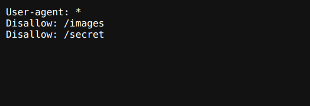
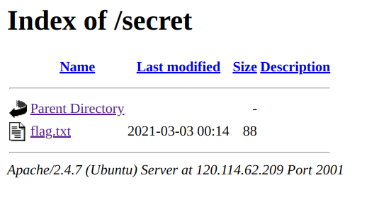
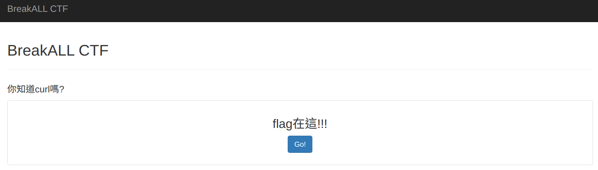
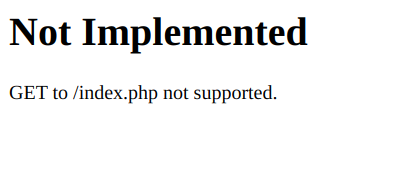

# Web101

## Web-1:source code
> 網站有許多漏洞，從底下的登入網址，你認為有幾種方式可以入侵?  
提示1 : 如何看到網站的原始碼?  
提示2 : 如何從網站的原始碼看到你所需要的資訊?  
提示3 : 答案格式 BreakALLCTF{xxxxxxxxxxx}  
請連結以下網址:
http://120.114.62.209:1001/

### solution
flag in html comment

## web-2: Easy_Robots.txt
>robots.txt是一種文字檔案，它告訴網路搜尋引擎此網站中的哪些內容是不應被搜尋引擎的搜尋到的，哪些是可以被搜尋引擎搜尋到的。
但駭客卻常透過robots.txt來知道哪些網頁目錄含有重要或是隱私資訊。  
本題任務是請你找到robots.txt並因此找到flag。  
提示1 : robots.txt的存放放置  
請連結以下網址:
http://120.114.62.209:2006/
### solution
`http://120.114.62.209:2006/robots.txt`

## web-3:Robots.txt
> robots.txt是一種文字檔案，它告訴網路搜尋引擎此網站中的哪些內容是不應被搜尋引擎的搜尋到的，哪些是可以被搜尋引擎搜尋到的。
但駭客卻常透過robots.txt來知道哪些網頁目錄含有重要或是隱私資訊。  
本題任務是請你找到robots.txt並因此找到flag。  
提示1 : robots.txt的存放放置  
提示2 : 相關hex to string及base64 編碼  
請連結以下網址:
http://120.114.62.209:2001/

### solution
link to `http://120.114.62.209:2001/robots.txt`

link to `http://120.114.62.209:2001/secret`

link to `http://120.114.62.209:2001/secret/flag.txt`  
get text `516e4a6c595774425445784456455a374e31463053304979546a5655624846425155563651334a36546b3939`

decode hex to string   
`QnJlYWtBTExDVEZ7N1F0S0IyTjVUbHFBQUV6Q3J6Tk99`  
then decode to base 64

## web-4:Curl-1
> 網址重新導向(URL redirection)的技術 請到wiki上看看URL redirection的原理及用途 https://zh.wikipedia.org/wiki/網域名稱轉址  
提示1 : 如何從網站的原始碼找到你所需要的資訊?  
提示2 : 本題可以使用curl工具輕鬆解題  
請連結以下網址進行解題:  
http://120.114.62.209:2014/

### solution
link to `http://120.114.62.209:2014/`

the go button will link to `http://120.114.62.209:2014/index.php`   
but that is a redirect link to `http://120.114.62.209:2014/no_flag_is_here.php`  
so use `curl` to link to `index.php`
```bash
$ curl http://120.114.62.209:2014/index.php
```

## web-5:HTTP method
> 你對HTTP Status Code及HTTP request methods了解嗎?  
請連結以下網址:  
http://120.114.62.209:3001/  
from: ACTF

### solution
link to `http://120.114.62.209:3001/index.php` 
  
使用`curl`檢查可以使用的request method  
```bash
$ curl -v -X OPTIONS http://120.114.62.209:3001/index.php
*   Trying 120.114.62.209:3001...
* Connected to 120.114.62.209 (120.114.62.209) port 3001 (#0)
> OPTIONS /index.php HTTP/1.1
> Host: 120.114.62.209:3001
> User-Agent: curl/7.81.0
> Accept: */*
> 
* Mark bundle as not supporting multiuse
< HTTP/1.1 200 OK
< Date: Sun, 17 Sep 2023 06:55:25 GMT
< Server: Apache/2.4.7 (Ubuntu)
< X-Powered-By: PHP/5.5.9-1ubuntu4.29
< Allow: GETFLAG,OPTIONS
< Content-Length: 0
< Content-Type: text/html
< 
* Connection #0 to host 120.114.62.209 left intact
```  
在`Allow`中可以看到可以使用的request method有一項為`GETFLAG`  
使用`curl`使用`GETFLAG` method
```bash
$ curl -X GETFLAG http://120.114.62.209:3001/index.php
```

